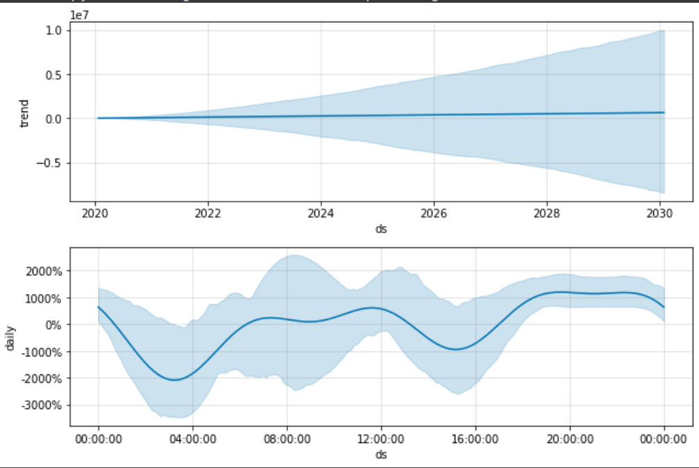
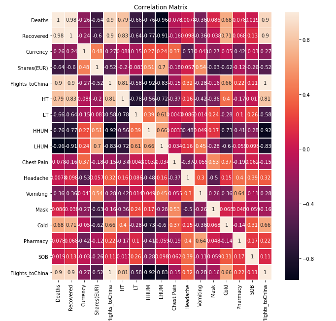
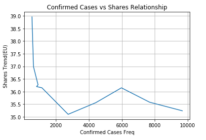
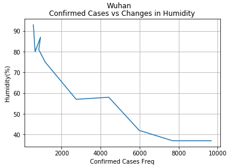
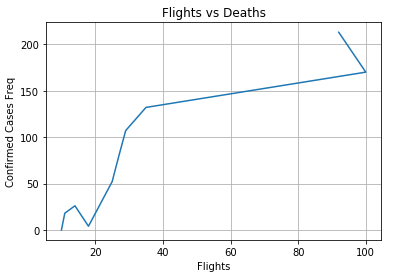

# Corona Prophet Prediction

2019-nCoV Global Cases by Johns Hopkins

https://gisanddata.maps.arcgis.com/apps/opsdashboard/index.html#/bda7594740fd40299423467b48e9ecf6

With the objective of understanding and minimizing epidemic spread, we devloped an method to accuractely predict and visualize the necessary features relating to **n-Corona virus** using *Time Series Analysis* and *EDA*.

The following dataset has been taken from 
[Novel Corona Virus 2019 Dataset:](https://www.kaggle.com/sudalairajkumar/novel-corona-virus-2019-dataset) along witrh custom feature engineering by extracting data from web.
## China Death Trends

Following trend indicates **daily,weekly,monthly** trend in confirmed death rates in China .It was obtained using [Prophet:](https://facebook.github.io/prophet/) an open source tool for Time Series analysis.

## Uncertainty in Prediction

## Correlation Matrix 

_Pearson’s correlation coefficient is the test statistics that measures the statistical relationship, or association, between two continuous variables.  It is known as the best method of measuring the association between variables of interest because it is based on the method of covariance.  It gives information about the magnitude of the association, or correlation, as well as the direction of the relationship._

Features include  *StockPrice*,*Lowest/Highest Daily Temperature*,*Humidity(%)*,*StockPrice*,*Currency*,search terms such as *cold,etc*.

## Feature Relationships
We explore the relationship of various features with the spread of the disease  by plotting graphs.

- Stock Price Relationship

-  Humidity  Relationship

-  Flights Search  Relation

-  Lowest Temperature  Relation

## References
- asdsad 

- asdsadsa

- asdsadas

